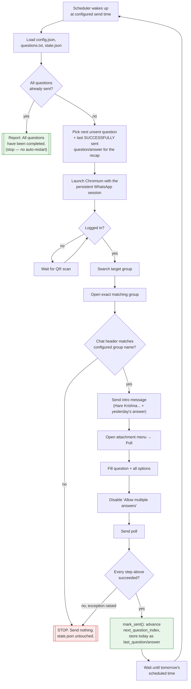

# Daily Quiz Bot 🙏

A free, self-hosted WhatsApp bot that posts one daily Bhagavad-Gita /
Mahabharata quiz question to a WhatsApp group — as a real **native
WhatsApp Poll**, preceded by a fixed intro message that recaps
yesterday's correct answer.

No paid APIs. No WhatsApp Business API, WhatsApp Cloud API, or
Twilio. It drives the ordinary [WhatsApp Web](https://web.whatsapp.com)
UI with [Playwright](https://playwright.dev/) + Chromium, the same way
a person would.

```
python3 main.py --once     # send today's quiz right now, then exit
python3 main.py             # run forever, sending automatically at the configured time
```

---

## Table of contents

- [How it works](#how-it-works)
- [Project layout](#project-layout)
- [Setup](#setup)
- [Configuration](#configuration)
- [The question bank format](#the-question-bank-format)
- [State &amp; failure safety](#state--failure-safety)
- [Running it](#running-it)
- [Content notes: what was fixed, and what to double-check](#content-notes-what-was-fixed-and-what-to-double-check)
- [Troubleshooting](#troubleshooting)

---

## How it works

Every message follows one fixed template, with no extra commentary,
emojis, or greetings added:

```
Hare Krishna 🙏

Today's quiz 👇

[Today's Question]

(Yesterday's question - Answer: [correct answer])
```

...immediately followed by a **native WhatsApp Poll** for today's
question, with *Allow multiple answers* switched off.



The critical guarantee: **state.json is only ever updated *after* a
poll has actually been sent successfully.** If anything fails partway
— WhatsApp not loading, wrong group, a selector not found, a network
hiccup — the exception aborts the run, state.json is left completely
untouched, and the *next* scheduled run retries the *same* question.
Nothing is ever skipped, and nothing is double-sent from a restart,
because a restart always resumes from the last successfully recorded
question.

---

## Project layout

```
whatsapp-poll-bot/
├── questions.txt        # question bank (see format below)
├── parser.py            # reads + validates questions.txt
├── test_parser.py        # unit tests for parser.py (no pytest needed)
├── state.py              # reads/writes state.json, with the "only advance
│                          #   after a real send" guarantee
├── whatsapp.py            # all Playwright/WhatsApp Web browser automation
├── scheduler.py           # waits until the configured daily send time
├── main.py                # orchestrates one full daily cycle
├── config.json            # group name + schedule
├── state.json             # created automatically on first successful send
├── requirements.txt
├── .gitignore
├── LICENSE
└── README.md
```

Each file has exactly one job (see the module docstring at the top of
each `.py` file for details):

| File | Responsibility |
|---|---|
| `parser.py` | Parse + validate `questions.txt` into question/option/answer objects. Rejects malformed content loudly instead of silently guessing. |
| `state.py` | Load/save `state.json` atomically. Owns the "advance only after a confirmed send" rule. |
| `whatsapp.py` | Drive the WhatsApp Web UI: login, search/open/verify group, send text message, build + send native poll. Knows nothing about quiz content. |
| `scheduler.py` | Pure time math: "how long until the next 9:00 AM?" |
| `main.py` | Wires everything together for one cycle, and loops via `scheduler` in normal mode. |

---

## Setup

**1. Install dependencies**

```bash
pip install -r requirements.txt
playwright install chromium
```

**2. Configure your group** — edit `config.json`:

```json
{
    "group_name": "YOUR GROUP NAME",
    "send_hour": 9,
    "send_minute": 0
}
```

`group_name` must match the group's name **exactly** as it appears in
WhatsApp (the bot verifies the open chat's header against this string
before sending anything, and refuses to send if it doesn't match).

**3. First run — scan the QR code once**

```bash
python3 main.py --once
```

A Chromium window opens to WhatsApp Web. Scan the QR code with your
phone the first time only. The session is saved in `whatsapp_session/`
(a Playwright *persistent context*), so you will not need to scan it
again on future runs as long as that folder is preserved and the
WhatsApp Web session hasn't been logged out from your phone.

---

## Configuration

| Key | Meaning |
|---|---|
| `group_name` | Exact WhatsApp group name to post to. |
| `send_hour` / `send_minute` | 24-hour local time the bot sends the daily quiz in normal (non `--once`) mode. |

---

## The question bank format

`questions.txt` uses a simple, explicit, human-editable format —
deliberately different from the old free-text format, because that one
had **no way to mark a correct answer at all**. Now every question
states its own answer directly:

```
Q: <question text>
A) <option 1>
B) <option 2>
C) <option 3>
D) <option 4>
ANSWER: C
```

Rules, enforced by `parser.py` (a bad file fails loudly, before the
bot ever tries to send anything):

- 2 to 12 options per question (12 is WhatsApp Poll's own hard limit).
- No empty options, no duplicate options (case-insensitive).
- Exactly one `ANSWER:` line, and it must point at a letter that
  actually has an option.
- Blank lines separate questions; `#` lines are comments.

To add or edit questions, just add another block in this format
anywhere in the file — order in the file **is** quiz order (question 1
in the file is sent first, and so on).

---

## State & failure safety

`state.json` (created automatically after the first successful send):

```json
{
    "next_question_index": 5,
    "last_question": "...",
    "last_answer": "...",
    "last_sent_at": "2026-09-23T09:00:00+05:30",
    "completed": false
}
```

- `next_question_index` — 0-based index into `questions.txt` of the
  question that will be sent next.
- `last_question` / `last_answer` — the question/answer that were
  **actually, successfully sent last**, used for tomorrow's recap
  line. This is *not* simply "yesterday's index minus one": if a send
  ever fails, the failed question is retried and `last_question` stays
  pointed at the last real success, so the recap line is never wrong.
- `last_sent_at` — timestamp of the last successful send.
- `completed` — set once every question in `questions.txt` has been
  sent; the bot then reports **"All questions have been completed."**
  and does **not** restart from question 1 automatically.

On the very first run there is no previous question yet, so the recap
line is omitted entirely rather than showing a fake one.

Writes to `state.json` are atomic (write-to-temp + rename) and a
rolling `state.json.bak` backup is kept, purely as a safety net for
manual recovery — but the real safety guarantee is architectural:
**`mark_sent()` is the only thing that advances state, and `main.py`
only calls it after every WhatsApp step has completed without
raising.**

---

## Running it

```bash
# Send exactly one quiz cycle right now, then exit:
python3 main.py --once

# Run forever, sending automatically every day at config.json's time:
python3 main.py
```

Run the test suite any time (no live WhatsApp needed):

```bash
python3 test_parser.py
```

---

## Content notes: what was fixed, and what to double-check

The original `questions.txt` had **no correct answers recorded at
all** — none of the 241 questions had an answer key anywhere in the
file. Correct answers for all questions (plus the one bonus question
that the old parser was silently dropping) have been researched and
added based on the Bhagavad-gita As It Is text and standard Mahabharata
narrative, with web verification for the less common trivia. Two
content problems in the original file were also corrected:

- **Question "How long did the battle of Kurukshetra go on?"** — the
  source file only had 3 options (a 4th was missing). Added a 4th
  distractor option ("10 days"); the correct answer is 18 days.
- **Question "Who arranged to stop the Sarpa Yajna of Janamejaya…?"**
  — none of the 4 original options was actually correct (the real
  answer is the sage **Astika**). The options were replaced so the
  poll doesn't offer only wrong answers.

A small number of the more obscure trivia questions are flagged below
as **worth a second look** before this goes live to a group — my
research gives a confident best answer for each, but these particular
ones are genuinely obscure enough (minor named rishis, a specific
queen's name, etc.) that I'd rather flag the uncertainty than present
false confidence:

- *"Drona and Bhishma possessed a common boon. Name it"*
- *"Unfair killing of Abhimanyu in the Padmavyuha was suggested by"*
- *"How was the demon Kali disguised as when Parikshit had noticed him?"*
- *"Who was the wife of Parikshit?"*
- *"Which rishi blessed the exiled Pandavas at Kamakya forest…?"*
- *"After the death of Pandu and Madri…Kunti and the Pandavas were brought to Hastinapura by"*
- *"Name the rishi who narrated the history of Parasurama to the Pandavas"*
- *"Which rishi once assumed the form of a swan?"*

These are ordinary quiz questions, not safety-relevant — if one turns
out to be wrong, it's a one-line fix in `questions.txt` (just move the
`ANSWER:` letter).

---

## Troubleshooting

- **QR code every time** — make sure `whatsapp_session/` isn't being
  deleted between runs (check `.gitignore` and any deployment scripts
  that might wipe it), and that you haven't logged the linked device
  out from your phone's WhatsApp settings.
- **"Wrong chat is open"** — `group_name` in `config.json` must match
  the group's display name exactly, including emoji/punctuation.
- **A selector isn't found / poll composer looks different** —
  WhatsApp Web's UI changes over time; `whatsapp.py` isolates all the
  Playwright selectors in one place, so that's the only file that
  should need updating.
- **A question was skipped or repeated** — shouldn't happen by design
  (see [State & failure safety](#state--failure-safety)), but if
  `state.json` ever looks wrong, `state.json.bak` has the previous
  version.
